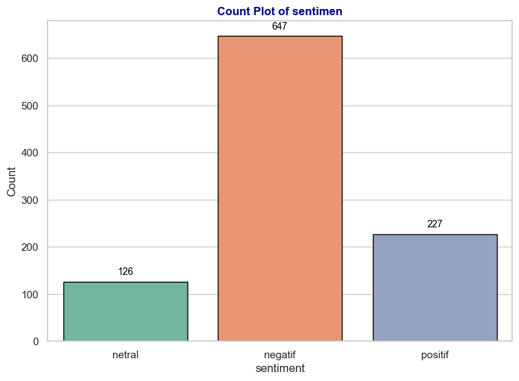
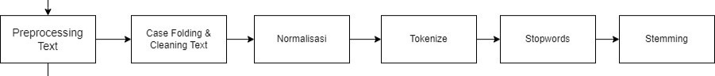

#  Sentiment Analysis Instagram Review
 
 

## Background
Instagram is a popular social media platform used by millions globally. User reviews on the Google Play Store provide insights into satisfaction and feedback. This project aims to predict the sentiment of Instagram reviews using a multiclass classifier.

## Exploratory Data Analysis
1. What Happened?

There are 3 types of sentiments: 227 for positive, 647 for negative, and 126 for neutral.

2. What words frequently appear in the reviews?

.png)

Most users type words such as "saya", "tidak", "bisa", "dan", "instagram", "akun", "fitur", and others when writing Instagram reviews.

3. What positive words often appear in reviews?

.png)

Most users type words such as "bagus", "aplikasi", "instagram", "akun", "fitur", and others when writing Instagram reviews.

4. What neutral words often appear in reviews?

.png)

Most users type words such as "aplikasi", "baik", "update", "instagram", "akun", "fitur", and others when writing Instagram reviews.

5. What negative words often appear in reviews?

.png)

Most users type words such as "tolong", "bug", "instagram", "akun", "fitur", “buruk” and others when writing Instagram reviews.

## Preprocessing
Workflow for Preprocessing Text:

.png)

## Feature Extraction
I did TF-IDF method on feature extraction.

## Oversampling with SMOTE
.png)

This dataset is imbalanced, I use SMOTE to make it balanced.

## Modeling
I use Random Forest, Decision Tree, Logistic Regression, Naive Bayes, KNeighborsClassifier and Linear SVC for Model Development.

## Evaluation
- I'm still paying attention to the accuracy score as well since this metric is easier to interpret.
- The model's performance was evaluated using metrics such as precision, recall, and F1-score.

.png)

Random Forest Classifier give the highest performance

## Deployment with Streamlit
To deploy the Streamlit app, I ensured all dependencies were installed, prepared a requirements.txt file, and deployed via Streamlit Sharing, linking a GitHub repository for automated updates.

.png)

## Conclusion
The RandomForestClassifier demonstrated the best performance with an accuracy of 91.8%, F1-score of 0.9188, recall of 0.9177, and precision of 0.9254. This model exhibits an excellent balance between precision and recall, making it the top choice for sentiment classification. It was deployed via Streamlit, enabling an interactive interface for real-time sentiment predictions (positive, negative, or neutral).
